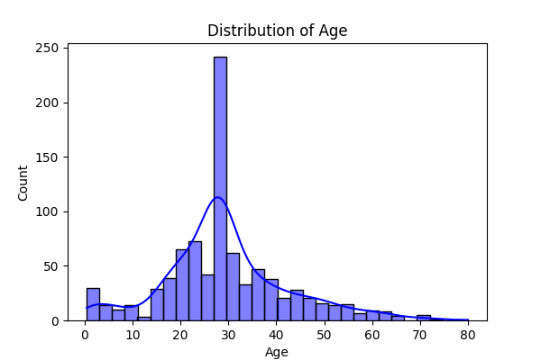
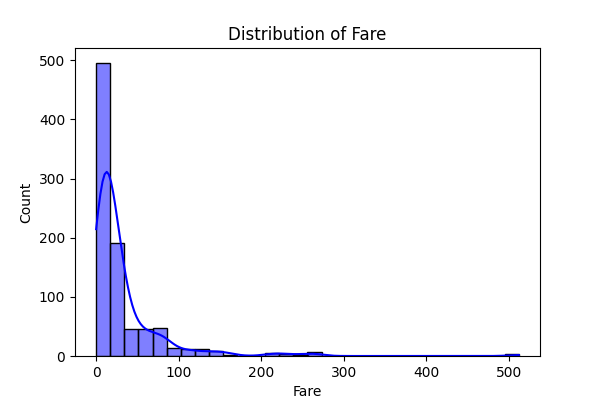
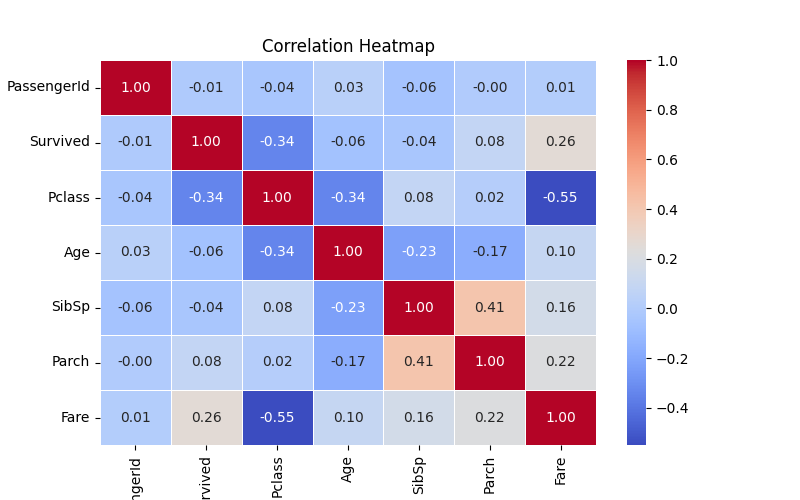

<!DOCTYPE html>
<html lang="en">
<head>
  <meta charset="UTF-8">

</head>
<body>

  <h1>📊 EDA Automation using LLM</h1>

  

    This project demonstrates how to automate Exploratory Data Analysis (EDA) using Large Language Models (LLMs). By leveraging the capabilities of LLMs, the system can analyze datasets, generate insights, and produce visualizations without manual intervention.
  

  

  <h2>🚀 Features</h2>
  <ul>
    <li>Automated data profiling and summary generation</li>
    <li>Visualization of data distributions and correlations</li>
    <li>Interactive interface for user inputs and queries</li>
    <li>Utilizes pre-trained LLMs for natural language understanding</li>
  </ul>

  

  <h2>🛠️ Installation</h2>
  
To set up the project locally, follow these steps:

  <ol>
    <li>Clone the repository:
      <pre><code>git clone https://github.com/kunalmahadule/EDA-Automation-using-LLM.git</code></pre>
    </li>
    <li>Navigate to the project directory:
      <pre><code>cd EDA-Automation-using-LLM</code></pre>
    </li>
    <li>Install the required dependencies:
      <pre><code>pip install -r requirements.txt</code></pre>
    </li>
    <li>Run the application:
      <pre><code>python app.py</code></pre>
    </li>
  </ol>

  

  <h2>📂 Project Structure</h2>
  <ul>
    <li><code>app.py</code> – Main application script</li>
    <li><code>code.ipynb</code> – Jupyter notebook with EDA processes</li>
    <li><code>data.csv</code> – Sample dataset used for analysis</li>
    <li><code>titanic_dataset_final.csv</code> – Final processed dataset</li>
    <li><code>*.png</code> – Generated visualizations</li>
    <li><code>README.md</code> – Project documentation</li>
  </ul>

  

  <h2>📊 Sample Visualizations</h2>
  
Here are some of the visualizations generated by the system:

  <ul>
    <li><strong>Age Distribution:</strong> 
      
    </li>
    <li><strong>Fare Distribution:</strong> 
      
    </li>
    <li><strong>Correlation Heatmap:</strong> 
      
    </li>
  </ul>

  

  <h2>📌 Usage</h2>
  
After running the application, you can interact with the system to perform EDA on your datasets. Upload your CSV files, and the system will generate summaries and visualizations automatically.

  

  <h2>👤 Author</h2>
  
Developed by <strong>Kunal Mahadule</strong>

  
GitHub: <a href="https://github.com/kunalmahadule" target="_blank">https://github.com/kunalmahadule</a>

  

  
⭐ If you find this project useful, please consider starring the repository!

</body>
</html>
